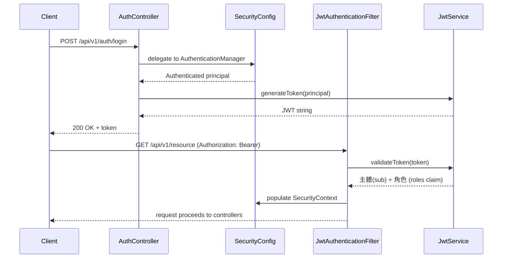
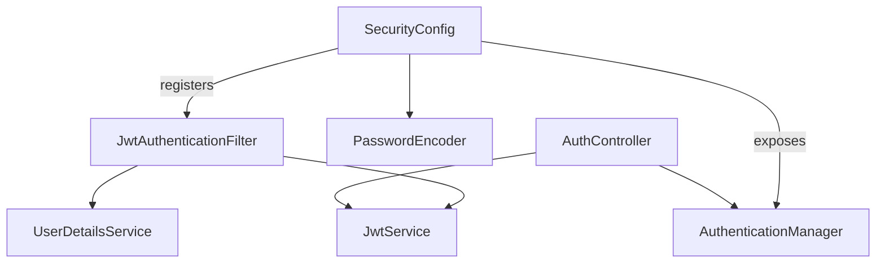
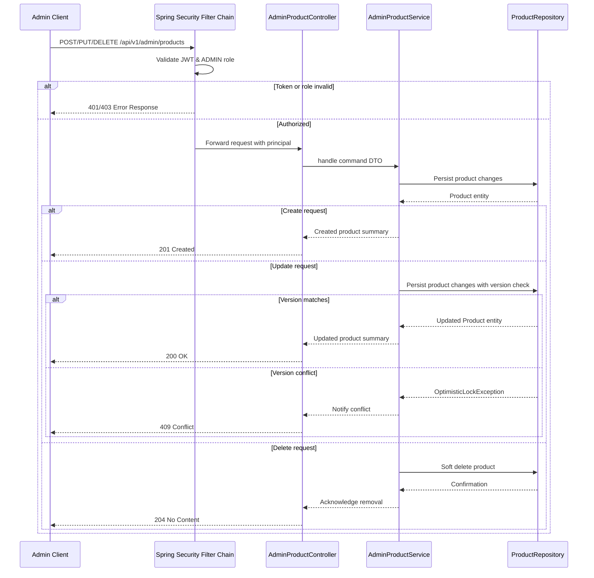

# Architecture Overview

This document captures the current relational schema that Liquibase applies when the service boots. Keep this section synchronized with the change logs under `src/main/resources/db/changelog`.

## Database Schema (MySQL)

```sql
CREATE TABLE users (
    id BIGINT AUTO_INCREMENT PRIMARY KEY,
    email VARCHAR(255) NOT NULL,
    password_hash VARCHAR(255) NOT NULL,
    role ENUM('USER','ADMIN') NOT NULL,
    created_at TIMESTAMP NOT NULL DEFAULT CURRENT_TIMESTAMP,
    updated_at TIMESTAMP NOT NULL DEFAULT CURRENT_TIMESTAMP ON UPDATE CURRENT_TIMESTAMP,
    UNIQUE KEY uq_users_email (email)
) ENGINE = InnoDB;

CREATE TABLE products (
    id BIGINT AUTO_INCREMENT PRIMARY KEY,
    title VARCHAR(255) NOT NULL,
    description TEXT,
    category VARCHAR(100) NOT NULL,
    price DECIMAL(10, 2) NOT NULL,
    stock INT NOT NULL,
    created_at TIMESTAMP NOT NULL DEFAULT CURRENT_TIMESTAMP,
    updated_at TIMESTAMP NOT NULL DEFAULT CURRENT_TIMESTAMP ON UPDATE CURRENT_TIMESTAMP,
    deleted_at TIMESTAMP NULL
) ENGINE = InnoDB;

CREATE TABLE orders (
    id BIGINT AUTO_INCREMENT PRIMARY KEY,
    user_id BIGINT NOT NULL,
    status ENUM('PENDING','PROCESSING','FAILED','COMPLETED') NOT NULL,
    idempotency_key VARCHAR(100) NOT NULL,
    total_amount DECIMAL(10, 2) NOT NULL,
    created_at TIMESTAMP NOT NULL DEFAULT CURRENT_TIMESTAMP,
    updated_at TIMESTAMP NOT NULL DEFAULT CURRENT_TIMESTAMP ON UPDATE CURRENT_TIMESTAMP,
    UNIQUE KEY uq_orders_idempotency (idempotency_key),
    CONSTRAINT fk_orders_user
        FOREIGN KEY (user_id) REFERENCES users(id)
        ON DELETE CASCADE
) ENGINE = InnoDB;

CREATE TABLE order_items (
    id BIGINT AUTO_INCREMENT PRIMARY KEY,
    order_id BIGINT NOT NULL,
    product_id BIGINT NOT NULL,
    quantity INT NOT NULL,
    unit_price DECIMAL(10, 2) NOT NULL,
    CONSTRAINT fk_order_items_order
        FOREIGN KEY (order_id) REFERENCES orders(id)
        ON DELETE CASCADE,
    CONSTRAINT fk_order_items_product
        FOREIGN KEY (product_id) REFERENCES products(id)
        ON DELETE RESTRICT
) ENGINE = InnoDB;

CREATE TABLE favorites (
    user_id BIGINT NOT NULL,
    product_id BIGINT NOT NULL,
    created_at TIMESTAMP NOT NULL DEFAULT CURRENT_TIMESTAMP,
    CONSTRAINT pk_favorites PRIMARY KEY (user_id, product_id),
    CONSTRAINT fk_favorites_user
        FOREIGN KEY (user_id) REFERENCES users(id)
        ON DELETE CASCADE,
    CONSTRAINT fk_favorites_product
        FOREIGN KEY (product_id) REFERENCES products(id)
        ON DELETE CASCADE
) ENGINE = InnoDB;
```

## Authentication Flow

The diagram below illustrates how Spring Security mediates requests, checking credentials on login and validating JWTs on subsequent calls before delegating to application controllers.



### Spring Security Components Wiring Snapshot



## Admin Product Management Flow

The sequence below outlines how the Admin role creates, updates, or deletes products while relying on our existing JWT security pipeline and layered responsibilities:



### Concurrency Strategy Overview

Order flows must protect inventory integrity under concurrent access. The table below summarizes candidate techniques, their trade-offs, and how they map to this codebase.

| Approach | Advantages | Drawbacks | Usage Notes |
|----------|------------|-----------|-------------|
| **Optimistic Lock (`@Version`)** | No blocking; great for read-heavy workloads; detects lost updates | High contention leads to retries; callers must handle `OptimisticLockException` | Ideal for infrequent admin edits. Requires adding a `version` column via Liquibase. |
| **Pessimistic Lock (`SELECT ... FOR UPDATE`)** | Guarantees serialized updates and prevents overselling | Requests wait for the row; poor ordering can deadlock | If locking multiple products per order, acquire locks in deterministic order (e.g., product id ascending). Configure sensible lock timeout. |
| **Atomic SQL (`UPDATE ... WHERE stock >= ?`)** | Single statement checks and decrements stock; minimal contention | Must inspect affected row count and throw to rollback on failure | InnoDB acquires a row-level exclusive lock during the update, so concurrent transactions wait until the first commits. Wrap all decrements in one transaction and if any update returns 0 rows, throw business exception to trigger rollback. Compatible with optimistic lock for admin edits. |

Plan: use atomic SQL for user purchases to minimize contention, optionally complement with optimistic locking for admin-facing updates. Pessimistic locking remains a fallback when business rules demand strict serialization; ensure a consistent locking order to avoid deadlocks.
