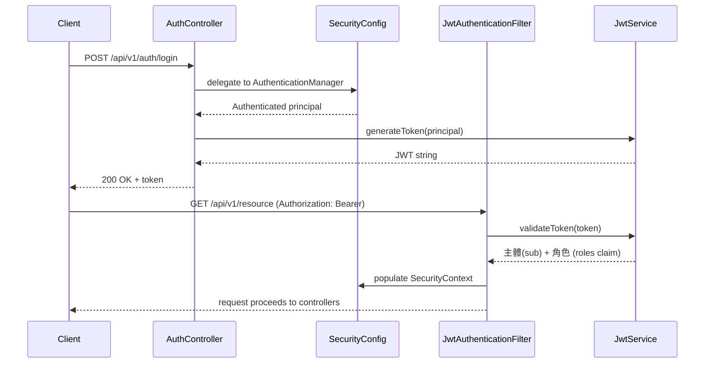
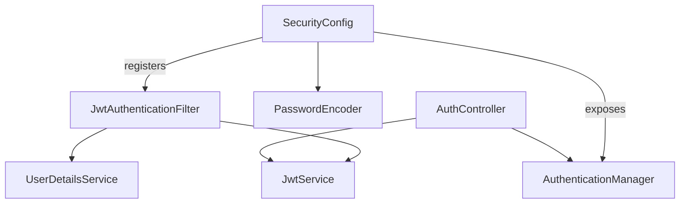
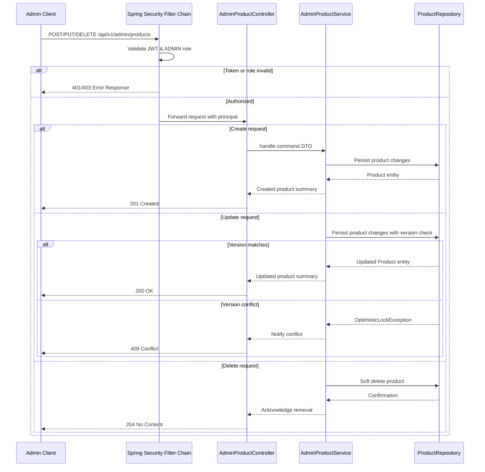
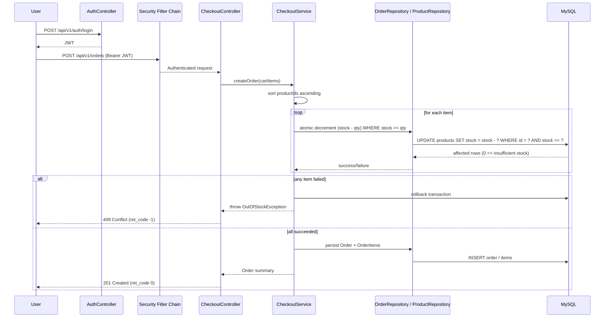
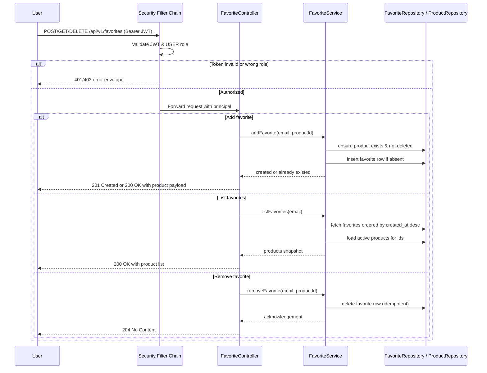
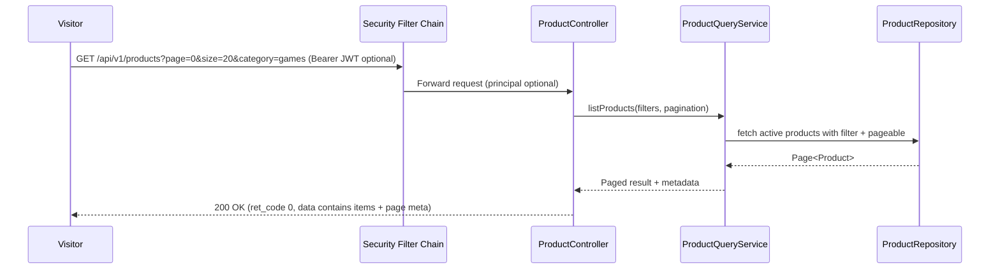
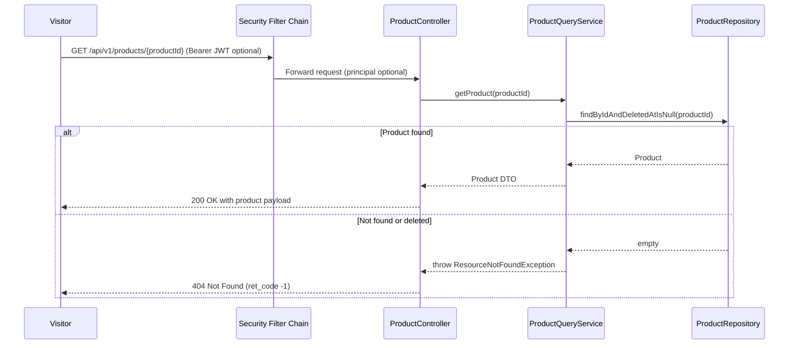
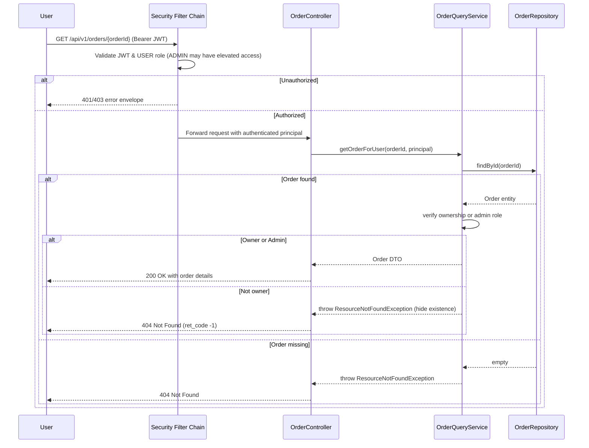

## Objective

- Deliver a resilient e-commerce backend that supports authenticated browsing, favorites, checkout, and admin maintenance while protecting all write paths with JWT/role-based access control.
- Using read/write separation, composite indexes, idempotency, and observability (correlation IDs, LogExecution, general logs when needed).
- Keep infrastructure reproducible via Docker Compose: one MySQL primary plus three replicas, Spring Boot app, Liquibase-managed schema migrations.
- Set the stage for asynchronous payment settlement (Webhook + MQ + worker) so checkout completes quickly and payment status can be updated later without data loss.

## Terminology

### Read/Write Separation

- Docker Compose provisions one MySQL primary plus three asynchronous replicas. Writes, Liquibase migrations, and any `@ReadFromPrimary` operations target the primary.
- Spring Boot registers a custom `AbstractRoutingDataSource` (`ReadReplicaRoutingDataSource`) that checks `TransactionSynchronizationManager.isCurrentTransactionReadOnly()` and round-robins queries across the configured replicas. If no replica is configured or a request enforces primary routing, it falls back automatically.
- Services that require strongly consistent reads (e.g., `OrderQueryService`) annotate with `@ReadFromPrimary`, which flips a ThreadLocal flag through an aspect so even read-only transactions hit the primary.

## Requirements

### Functional

- Issue JWT tokens via `POST /api/v1/auth/login`; enforce roles (`ROLE_USER`, `ROLE_ADMIN`) on all protected endpoints.
- Public catalog APIs expose pagination, category filtering, and keyword search; details endpoint returns only active (non-deleted) products.
- Favorites API allows users to add/list/remove favorites idempotently while filtering out deleted products.
- Admin APIs manage product lifecycle (create/update/soft-delete) with optimistic locking (`@Version`) and audit fields.
- Checkout API performs atomic stock decrement, records idempotency key, and persists `OrderStatus = PENDING`; order retrieval enforces ownership or admin role.
- Payment flow: external provider hits Webhook, system enqueues `PaymentResultEvent`, worker updates order status (COMPLETED/FAILED) and releases stock if necessary.

### Non Functional

| Area | Requirement                                                                                                                                                                       |
| --- |-----------------------------------------------------------------------------------------------------------------------------------------------------------------------------------|
| Security | Enforce Spring Security + JWT + `@PreAuthorize`; log every request with `@LogExecution` + correlation ID; admin-only endpoints protect inventory, pricing, and payment callbacks. |
| Performance | Target response time < 300ms p95 using composite indexes, read/write separation, and Slice queries.                                 |
| Reliability | All writes run inside transactions; optimistic locking + soft delete prevent lost updates; payment Webhook + MQ/outbox ensures eventual status updates even if worker crashes.    |
| Data Consistency | Primary handles writes and strongly consistent reads (`@ReadFromPrimary`), replicas serve read-only traffic; stock decrement uses atomic SQL, orders rely on idempotency keys.    |
| Scalability | Docker Compose allows adding replicas quickly; routing datasource can expand target nodes.                               |

## Design

### Architecture Overview (with diagrams)

```mermaid
flowchart TB
    %% === Entry Points ===
    subgraph Clients["Client Channels"]
        C1[Web Frontend]
        C2[Mobile App]
    end
    C1 & C2 --> LB["API Gateway / Load Balancer"]
    LB --> APP["Spring Boot Monolith"]

    %% === Controllers ===
    subgraph Controllers["Controller Layer"]
        AUTH["AuthController\n/login"]
        PRODUCT["ProductController\n(public browse/detail)"]
        FAVORITE["FavoriteController\n(user favorites)"]
        ADMIN["AdminProductController\n(admin CRUD)"]
        ORDER["OrderController\n(user checkout)"]
    end
    APP --> AUTH & PRODUCT & FAVORITE & ADMIN & ORDER

    %% === Services ===
    subgraph Services["Service Layer"]
        ProductSrv["ProductQueryService"]
        FavoriteSrv["FavoriteService"]
        AdminSrv["AdminProductService"]
        OrderSrv["CheckoutService\n+ OrderQueryService"]
        PaymentSrv["Payment Worker"]
    end
    PRODUCT --> ProductSrv
    FAVORITE --> FavoriteSrv
    ADMIN --> AdminSrv
    ORDER -->|create order with PENDING status| OrderSrv

    subgraph PaymentFlow["Payment Callback Flow"]
        PaymentWebhook["Payment Webhook Controller"]
        MQ["Message Queue"]
        PaymentSrv["Payment Worker"]
        PaymentWebhook --> OrderSrv
        PaymentWebhook --> MQ
        MQ --> PaymentSrv
    end

    %% === Security / Cross-cutting ===
    subgraph Security["Security & Common"]
        JwtFilter["JwtAuthenticationFilter"]
        JwtSvc["JwtService"]
        GlobalEx["GlobalExceptionHandler"]
        Docs["OpenAPI / Swagger UI"]
    end
    APP --> JwtFilter
    JwtFilter --> JwtSvc
    APP --> GlobalEx
    APP --> Docs

    %% === Data Access ===
    ProductSrv -->|public browse| READPOOL{{Read Replica Routing with LazyConnectionDataSourceProxy}}
    FavoriteSrv -->|@Transactional with readOnly=true| READPOOL
    OrderSrv -->|order lookups| PRIMARY
    FavoriteSrv -->|writes / mutations| PRIMARY[(MySQL Primary)]
    AdminSrv --> PRIMARY
    OrderSrv -->|checkout + persistence| PRIMARY
    PaymentSrv -->|update status / release stock if fail| PRIMARY
    JwtFilter -->|loadUserByUsername| PRIMARY

    READPOOL --> REPL1[(Replica 1)]
    READPOOL --> REPL2[(Replica 2)]
    READPOOL --> REPL3[(Replica 3)]
    PRIMARY -.replication.-> REPL1
    PRIMARY -.replication.-> REPL2
    PRIMARY -.replication.-> REPL3

    PRIMARY --> USERS[(Users Table)]
    PRIMARY --> PRODUCTS[(Products & Favorites Tables)]
    PRIMARY --> ORDERS[(Orders & OrderItems)]

    classDef db fill:#cfe2ff,stroke:#004c97,stroke-width:1.2px,color:#00264d;
    classDef service fill:#b7f0b1,stroke:#1d7c32,stroke-width:1.2px,color:#0a3b12;
    classDef cross fill:#ffe5b4,stroke:#cc7a00,stroke-width:1.2px,color:#4a2c00;

    class PRIMARY,USERS,PRODUCTS,ORDERS,REPL1,REPL2,REPL3 db;
    class ProductSrv,FavoriteSrv,AdminSrv,OrderSrv service;
    class JwtFilter,JwtSvc,GlobalEx,Docs cross;
```

### Component Design (key modules/services)

| Service | Responsibilities |
| --- | --- |
| AuthController / SecurityConfig | Handle JWT login, authenticate/authorize every request, expose password encoder and authentication manager. |
| ProductController / ProductQueryService | Public browse/detail endpoints, apply pagination/category/full-text filters, route read-only traffic to replicas, convert entities to DTOs. |
| FavoriteController / FavoriteService | Manage user favorites with idempotent add/remove, validate product existence, load favorite list ordered by `created_at`. |
| AdminProductController / AdminProductService | CRUD for products, enforce `ROLE_ADMIN`, wrap updates with optimistic locking and soft delete semantics. |
| OrderController / CheckoutService / OrderQueryService | Create orders with atomic stock decrement + idempotency key, serve order detail only to owners/admins, mark deleted products as inaccessible. |
| Payment Webhook Controller / Payment Worker | Accept third-party callbacks, enqueue events, update order status asynchronously (COMPLETED/FAILED) and release stock on failure. |


### Interface Design

- **Auth**
    - `POST /api/v1/auth/login` – Exchange credentials for a JWT access token. (Registration endpoint to be added.)
- **Admin**
    - `POST /api/v1/admin/products` – Create a product (requires `ROLE_ADMIN`, optimistic locking enabled).
    - `PUT /api/v1/admin/products/{productId}` – Update product details and stock (requires `ROLE_ADMIN`).
    - `DELETE /api/v1/admin/products/{productId}` – Soft-delete a product (requires `ROLE_ADMIN`).
- **Orders**
    - `POST /api/v1/orders` – Create an order for the authenticated user with atomic stock decrement (requires `ROLE_USER`).
    - `GET /api/v1/orders/{orderId}` – Retrieve order details (owner or `ROLE_ADMIN` only).
- **Products**
    - `GET /api/v1/products` – Browse active products with pagination, category filter, and keyword search (public).
    - `GET /api/v1/products/{productId}` – Retrieve a specific product's details (public).
- **Favorites**
    - `POST /api/v1/favorites` – Add a product to the authenticated user's favorites list (requires `ROLE_USER`).
    - `GET /api/v1/favorites` – Retrieve the authenticated user's favorite products in reverse chronological order.
    - `DELETE /api/v1/favorites/{productId}` – Remove a product from the favorites list (idempotent, requires `ROLE_USER`).

### Data Structure Design

```sql
CREATE TABLE users (
    id BIGINT AUTO_INCREMENT PRIMARY KEY,
    email VARCHAR(255) NOT NULL,
    password_hash VARCHAR(255) NOT NULL,
    role ENUM('USER','ADMIN') NOT NULL,
    created_at TIMESTAMP NOT NULL DEFAULT CURRENT_TIMESTAMP,
    updated_at TIMESTAMP NOT NULL DEFAULT CURRENT_TIMESTAMP ON UPDATE CURRENT_TIMESTAMP,
    UNIQUE KEY uq_users_email (email)
) ENGINE = InnoDB;

CREATE TABLE products (
    id BIGINT AUTO_INCREMENT PRIMARY KEY,
    title VARCHAR(255) NOT NULL,
    description TEXT,
    category VARCHAR(100) NOT NULL,
    price DECIMAL(10, 2) NOT NULL,
    stock INT NOT NULL,
    created_at TIMESTAMP NOT NULL DEFAULT CURRENT_TIMESTAMP,
    updated_at TIMESTAMP NOT NULL DEFAULT CURRENT_TIMESTAMP ON UPDATE CURRENT_TIMESTAMP,
    deleted_at TIMESTAMP NULL,
    version BIGINT NOT NULL,
    FULLTEXT KEY idx_products_title_description_fulltext (title, description),
    KEY idx_products_deleted_category_created (deleted_at, category, created_at)
) ENGINE = InnoDB;

CREATE TABLE orders (
    id BIGINT AUTO_INCREMENT PRIMARY KEY,
    user_id BIGINT NOT NULL,
    status ENUM('PENDING','PROCESSING','FAILED','COMPLETED') NOT NULL,
    idempotency_key VARCHAR(100) NOT NULL,
    total_amount DECIMAL(10, 2) NOT NULL,
    created_at TIMESTAMP NOT NULL DEFAULT CURRENT_TIMESTAMP,
    updated_at TIMESTAMP NOT NULL DEFAULT CURRENT_TIMESTAMP ON UPDATE CURRENT_TIMESTAMP,
    UNIQUE KEY uq_orders_idempotency (idempotency_key),
    CONSTRAINT fk_orders_user
        FOREIGN KEY (user_id) REFERENCES users(id)
        ON DELETE CASCADE
) ENGINE = InnoDB;

CREATE TABLE order_items (
    id BIGINT AUTO_INCREMENT PRIMARY KEY,
    order_id BIGINT NOT NULL,
    product_id BIGINT NOT NULL,
    quantity INT NOT NULL,
    unit_price DECIMAL(10, 2) NOT NULL,
    CONSTRAINT fk_order_items_order
        FOREIGN KEY (order_id) REFERENCES orders(id)
        ON DELETE CASCADE,
    CONSTRAINT fk_order_items_product
        FOREIGN KEY (product_id) REFERENCES products(id)
        ON DELETE RESTRICT
) ENGINE = InnoDB;

CREATE TABLE favorites (
    user_id BIGINT NOT NULL,
    product_id BIGINT NOT NULL,
    created_at TIMESTAMP NOT NULL DEFAULT CURRENT_TIMESTAMP,
    CONSTRAINT pk_favorites PRIMARY KEY (user_id, product_id),
    CONSTRAINT fk_favorites_user
        FOREIGN KEY (user_id) REFERENCES users(id)
        ON DELETE CASCADE,
    CONSTRAINT fk_favorites_product
        FOREIGN KEY (product_id) REFERENCES products(id)
        ON DELETE CASCADE
) ENGINE = InnoDB;
```

### Authentication Flow

The diagram below illustrates how Spring Security mediates requests, checking credentials on login and validating JWTs on subsequent calls before delegating to application controllers.



### Spring Security Components Wiring Snapshot



### Admin Product Management Flow

The sequence below outlines how the Admin role creates, updates, or deletes products while relying on our existing JWT security pipeline and layered responsibilities:



### Concurrency Strategy Overview

Order flows must protect inventory integrity under concurrent access. The table below summarizes candidate techniques, their trade-offs, and how they map to this codebase.

| Approach | Advantages | Drawbacks | Usage Notes                                                                                                                                                                                                                                                                                                                                                                   |
|----------|------------|-----------|-------------------------------------------------------------------------------------------------------------------------------------------------------------------------------------------------------------------------------------------------------------------------------------------------------------------------------------------------------------------------------|
| **Optimistic Lock (`@Version`)** | No blocking; great for read-heavy workloads; detects lost updates | High contention leads to retries; callers must handle `OptimisticLockException` | Ideal for infrequent admin edits. Requires adding a `version` column via Liquibase.                                                                                                                                                                                                                                                                                           |
| **Pessimistic Lock (`SELECT ... FOR UPDATE`)** | Guarantees serialized updates and prevents overselling | Requests wait for the row; poor ordering can deadlock | If locking multiple products per order, acquire locks in deterministic order (e.g., product id ascending). Configure sensible lock timeout.                                                                                                                                                                                                                                   |
| **Atomic SQL (`UPDATE ... WHERE stock >= ?`)** | Single statement checks and decrements stock; minimal contention | Must inspect affected row count and throw to rollback on failure | InnoDB acquires a row-level exclusive lock during the update, so concurrent transactions wait until the first commits. Wrap all decrements in one transaction(acquire locks in deterministic order for multiple products per order scenario) and if any update returns 0 rows, throw business exception to trigger rollback. Compatible with optimistic lock for admin edits. |

Plan: use atomic SQL for user purchases to minimize contention, optionally complement with optimistic locking for admin-facing updates. Pessimistic locking remains a fallback when business rules demand strict serialization; ensure a consistent locking order to avoid deadlocks.

### User Product Purchase Flow

The following sequence illustrates how a customer checks out a cart. Stock deductions rely on atomic SQL updates to avoid overselling while all operations remain within a single transaction.



Key points:
- Atomic SQL prevents overselling and avoids mixing read/write logic in the service.
- Products are processed in deterministic order (by product id) to reduce deadlock risk.
- Any failure (stock < requested quantity) results in a transaction rollback and a conflict response.

### User Favorites Management Flow



### Product Browsing Flow



### Product Details Flow



### Order Details Flow



## Design Checklist

| Consideration | Comments                                                                                                                                                                        |
| --- |---------------------------------------------------------------------------------------------------------------------------------------------------------------------------------|
| Error Handling | API responses use a consistent envelope via `GlobalExceptionHandler` and `ApiResponseEnvelope`; validation/auth/optimistic-lock errors surface as structured ret_code/msg/meta. |
| Security | JWT auth filter, `@PreAuthorize`, and admin-only endpoints guard sensitive paths; correlation IDs + LogExecution aid auditing.                                                  |
| Performance | Composite indexes, read/write routing, Slice queries, and planned Redis/ProxySQL keep p95 latency < 300ms.                                                                      |
| Reliability | Transactions, optimistic locking, idempotency keys, and MQ-ready payment flow prevent double writes or lost events; soft delete avoids destructive deletes.                     |
| Data Consistency | Primary handles writes/strong reads; replicas serve browse traffic; payment worker reconciles status asynchronously but deterministically.                                      |
| Scalability | Docker Compose can spin up more replicas; read routing can add nodes; MQ decouples payment from checkout for easier horizontal scaling.                                         |
| Testability | Layered architecture (controller/service/repository) eases unit testing; integration tests run via Maven Failsafe with H2 or real MySQL containers.                             |
| Compatibility | REST+JSON APIs documented via Swagger/OpenAPI; Webhook contract follows standard JSON payload + HMAC validation for payment callbacks.                                          |
